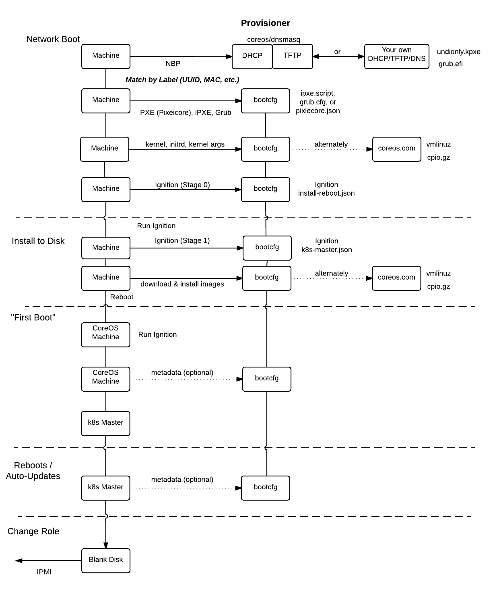

# Lifecycle of a Physical Machine

A physical machine [network boots](network-booting.md) in an network boot environment created by [coreos/dnsmasq](../contrib/dnsmasq) or a custom DHCP/TFTP/DNS setup.

`bootcfg` serves iPXE, GRUB, or Pixiecore boot configs via HTTP to machines based on group selectors (e.g. UUID, MAC, region, etc.). Kernel and initrd images are fetched and booted with an initial Ignition config for installing CoreOS. CoreOS is installed to disk and the provisioning Ignition config for the machine is fetched before rebooting.

CoreOS boots ("first boot" from disk) and runs Ignition to provision its disk with systemd units, files, keys, and more. On subsequent reboots, systemd units may fetch dynamic metadata if needed.

CoreOS hosts should have automatic updates enabled and use a system like fleet or Kubernetes to run containers to tolerate node updates or failures without operator intervention. Use IPMI, vendor utilities, or first-boot to re-provision machines to change their role, rather than mutation.

