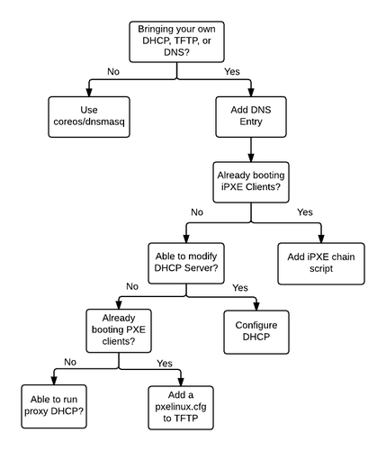

# Network setup

This guide shows how to create a DHCP/TFTP/DNS network boot environment to work with `matchbox` to boot and provision PXE, iPXE, or GRUB2 client machines.

`matchbox` serves iPXE scripts or GRUB configs over HTTP to serve as the entrypoint for CoreOS cluster bring-up. It does not implement or exec a DHCP, TFTP, or DNS server. Instead, you can configure your own network services to point to `matchbox` or use the convenient [coreos/dnsmasq](../contrib/dnsmasq) container image (used in libvirt demos).

*Note*: These are just suggestions. Your network administrator or system administrator should choose the right network setup for your company.

## Requirements

Client hardware must have a network interface which supports PXE or iPXE.

## Goals

* Add a DNS name which resolves to a `matchbox` deploy.
* Chainload PXE firmware to iPXE or GRUB2
* Point iPXE clients to `http://matchbox.foo:port/boot.ipxe`
* Point GRUB clients to `http://matchbox.foo:port/grub`

## Setup

Many companies already have DHCP/TFTP configured to "PXE-boot" PXE/iPXE clients. In this case, machines (or a subset of machines) can be made to chainload from `chain http://matchbox.foo:port/boot.ipxe`. Older PXE clients can be made to chainload into iPXE or GRUB to be able to fetch subsequent configs via HTTP.

On simpler networks, such as what a developer might have at home, a relatively inflexible DHCP server may be in place, with no TFTP server. In this case, a proxy DHCP server can be run alongside a non-PXE capable DHCP server.

This diagram can point you to the **right section(s)** of this document.



The setup of DHCP, TFTP, and DNS services on a network varies greatly. If you wish to use rkt or Docker to quickly run DHCP, proxyDHCP TFTP, or DNS services, use [coreos/dnsmasq](#coreosdnsmasq).

## DNS

Add a DNS entry (e.g. `matchbox.foo`, `provisoner.mycompany-internal`) that resolves to a deployment of the CoreOS `matchbox` service from machines you intend to boot and provision.

```sh
$ dig matchbox.foo
```

If you deployed `matchbox` to a known IP address (e.g. dedicated host, load balanced endpoint, Kubernetes NodePort) and use `dnsmasq`, a domain name to IPv4/IPv6 address mapping could be added to the `/etc/dnsmasq.conf`.

```
# dnsmasq.conf
address=/matchbox.foo/172.18.0.2
```

## iPXE

Servers with DHCP/TFTP/ services which already network boot iPXE clients can use the `chain` command to make clients download and execute the iPXE boot script from `matchbox`.

```
# /var/www/html/ipxe/default.ipxe
chain http://matchbox.foo:8080/boot.ipxe
```

You can chainload from a menu entry or use other [iPXE commands](http://ipxe.org/cmd) if you have needs beyond just delegating to the iPXE script served by `matchbox`.

## GRUB

Needs more docs.

`grub-mknetdir --net-directory=/var/lib/tftpboot`

/var/lib/tftpboot/boot/grub/grub.cfg:
```ini
insmod i386-pc/http.mod
set root=http,matchbox.foo:8080
configfile /grub
```

Make sure to replace variables in the example config files; instead of iPXE variables, use GRUB variables. Check the [GRUB2 manual](https://www.gnu.org/software/grub/manual/grub.html#Network).

### Configuring DHCP

Configure your DHCP server to supply options to older PXE client firmware to specify the location of an iPXE or GRUB network boot program on your TFTP server. Send clients to the `matchbox` iPXE script or GRUB config endpoints.

Here is an example `/etc/dnsmasq.conf`:

```ini
dhcp-range=192.168.1.1,192.168.1.254,30m

enable-tftp
tftp-root=/var/lib/tftpboot

# if request comes from older PXE ROM, chainload to iPXE (via TFTP)
dhcp-boot=tag:!ipxe,undionly.kpxe
# if request comes from iPXE user class, set tag "ipxe"
dhcp-userclass=set:ipxe,iPXE
# point ipxe tagged requests to the matchbox iPXE boot script (via HTTP)
dhcp-boot=tag:ipxe,http://matchbox.foo:8080/boot.ipxe

# verbose
log-queries
log-dhcp

# static DNS assignements
address=/matchbox.foo/192.168.1.100

# (optional) disable DNS and specify alternate
# port=0
# dhcp-option=6,192.168.1.100
```

Add [unidonly.kpxe](http://boot.ipxe.org/undionly.kpxe) (and undionly.kpxe.0 if using dnsmasq) to your tftp-root (e.g. `/var/lib/tftpboot`).

```sh
$ sudo systemctl start dnsmasq
$ sudo firewall-cmd --add-service=dhcp --add-service=tftp [--add-service=dns]
$ sudo firewall-cmd --list-services
```

#### proxy DHCP

Alternately, a DHCP proxy server can be run alongside an existing non-PXE DHCP server. The proxy DHCP server provides only the next server and boot filename Options, leaving IP allocation to the DHCP server. Clients listen for both DHCP offers and merge the responses as though they had come from one PXE-enabled DHCP server.

Example `/etc/dnsmasq.conf`:

```ini
dhcp-range=192.168.1.1,proxy,255.255.255.0

enable-tftp
tftp-root=/var/lib/tftpboot

# if request comes from older PXE ROM, chainload to iPXE (via TFTP)
pxe-service=tag:#ipxe,x86PC,"PXE chainload to iPXE",undionly.kpxe
# if request comes from iPXE user class, set tag "ipxe"
dhcp-userclass=set:ipxe,iPXE
# point ipxe tagged requests to the matchbox iPXE boot script (via HTTP)
pxe-service=tag:ipxe,x86PC,"iPXE",http://matchbox.foo:8080/boot.ipxe

# verbose
log-queries
log-dhcp
```

Add [unidonly.kpxe](http://boot.ipxe.org/undionly.kpxe) (and undionly.kpxe.0 if using dnsmasq) to your tftp-root (e.g. `/var/lib/tftpboot`).

```sh
$ sudo systemctl start dnsmasq
$ sudo firewall-cmd --add-service=dhcp --add-service=tftp [--add-service=dns]
$ sudo firewall-cmd --list-services
```

With rkt:

```sh
$ sudo rkt run coreos.com/dnsmasq:v0.3.0 --net=host -- -d -q --dhcp-range=192.168.1.1,proxy,255.255.255.0 --enable-tftp --tftp-root=/var/lib/tftpboot --dhcp-userclass=set:ipxe,iPXE --pxe-service=tag:#ipxe,x86PC,"PXE chainload to iPXE",undionly.kpxe --pxe-service=tag:ipxe,x86PC,"iPXE",http://matchbox.foo:8080/boot.ipxe --log-queries --log-dhcp
```

With Docker:

```sh
$ sudo docker run --net=host --rm --cap-add=NET_ADMIN quay.io/coreos/dnsmasq -d -q --dhcp-range=192.168.1.1,proxy,255.255.255.0 --enable-tftp --tftp-root=/var/lib/tftpboot --dhcp-userclass=set:ipxe,iPXE --pxe-service=tag:#ipxe,x86PC,"PXE chainload to iPXE",undionly.kpxe --pxe-service=tag:ipxe,x86PC,"iPXE",http://matchbox.foo:8080/boot.ipxe --log-queries --log-dhcp
```

### Configurable TFTP

If your DHCP server is configured to PXE boot clients, but you don't have control over this configuration, you can modify the pxelinux.cfg's served to PXE clients.

Example `/var/lib/tftpboot/pxelinux.cfg/default`:

```
timeout 10
default iPXE
LABEL iPXE
KERNEL ipxe.lkrn
APPEND dhcp && chain http://matchbox.foo:8080/boot.ipxe
```

Add ipxe.lkrn to `/var/lib/tftpboot` (see [iPXE docs](http://ipxe.org/embed)).

## coreos/dnsmasq

On networks without network services, the `coreos.com/dnsmasq:v0.3.0` rkt ACI or `coreos/dnsmasq:latest` Docker image can setup an appropriate environment quickly. The images bundle `undionly.kpxe` and `grub.efi` for convenience. Here are some examples which run a DHCP/TFTP/DNS server on your host's network:

With rkt:

```sh
$ sudo rkt trust --prefix coreos.com/dnsmasq
# gpg key fingerprint is: 18AD 5014 C99E F7E3 BA5F  6CE9 50BD D3E0 FC8A 365E
```

```sh
$ sudo rkt run coreos.com/dnsmasq:v0.3.0 --net=host -- -d -q --dhcp-range=192.168.1.3,192.168.1.254 --enable-tftp --tftp-root=/var/lib/tftpboot --dhcp-userclass=set:ipxe,iPXE --dhcp-boot=tag:#ipxe,undionly.kpxe --dhcp-boot=tag:ipxe,http://matchbox.foo:8080/boot.ipxe --address=/matchbox.foo/192.168.1.2 --log-queries --log-dhcp
```

With Docker:

```sh
$ sudo docker run --rm --cap-add=NET_ADMIN --net=host quay.io/coreos/dnsmasq -d -q --dhcp-range=192.168.1.3,192.168.1.254 --enable-tftp --tftp-root=/var/lib/tftpboot --dhcp-userclass=set:ipxe,iPXE --dhcp-boot=tag:#ipxe,undionly.kpxe --dhcp-boot=tag:ipxe,http://matchbox.foo:8080/boot.ipxe --address=/matchbox.foo/192.168.1.2 --log-queries --log-dhcp
```

Ensure that `matchbox.foo` resolves to a `matchbox` deployment and that you've allowed the services to run in your firewall configuration.

```sh
$ sudo firewall-cmd --add-service=dhcp --add-service=tftp --add-service=dns
```

## Troubleshooting

See [troubleshooting](troubleshooting.md).
